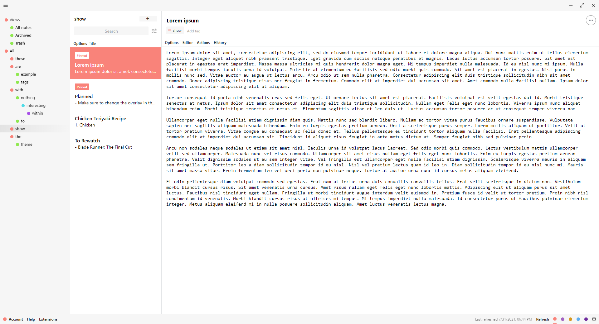
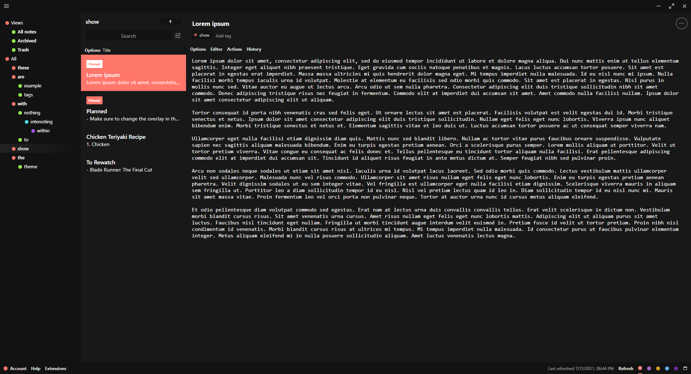

# Coral theme for Standard Notes
**Coral is a dynamic theme** for Standard Notes. Its colour changes automatically based on your system colour theme. See the screenshots below of both the light and dark versions.
If you're on Windows 10 or 11, you can have your system theme change automatically using [Windows Auto Dark Mode](https://github.com/AutoDarkMode/Windows-Auto-Night-Mode).

This theme has only been tested on Windows 10 and only with the plain editor.

## Installation

1. Open Standard Notes
2. In the bottom left corner, click "Extensions", then "Import Extension"
3. Enter "https://cdn.jsdelivr.net/gh/silencebow/sn-theme-coral/extension.json" as the extension link
4. Click enter and confirm the installation
5. Activate the extension

## Screenshots

Light

Dark
